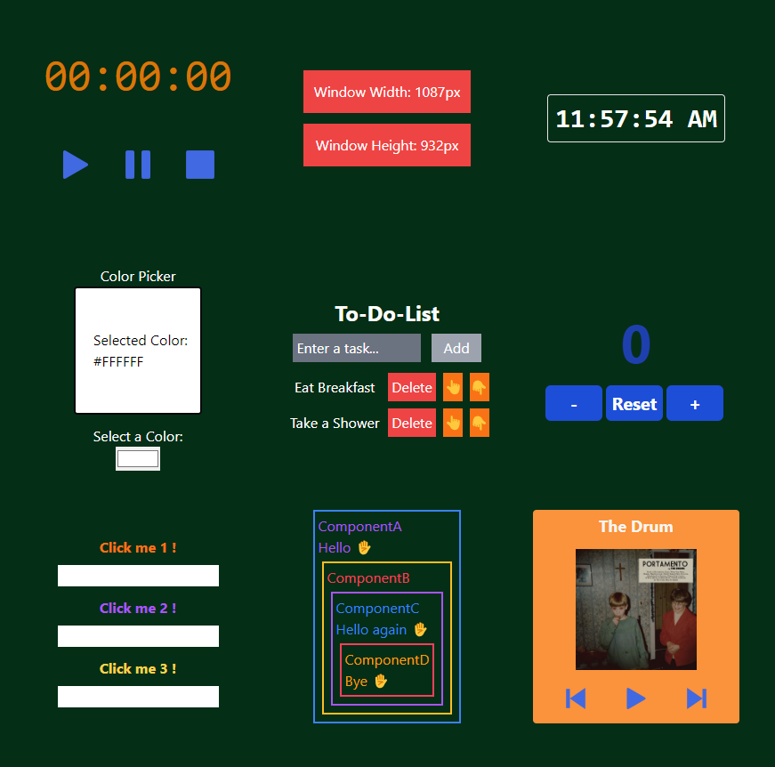

# React Learning 📘

React is a JavaScript library for building user interfaces. React is used to build single-page applications.

## Features 🌟

- 🖥️ User-friendly interface
- 🧩 Component-based architecture
- 🌐 State management and updates
- 🚀 Usage of React Hooks


## Technologies Used 💻

- 💻 [React.js](https://reactjs.org/) - JS library for crafting user interfaces
- 📦 [Vite](https://vitejs.dev/) - Module bundler
- 🎨 [Tailwind CSS](https://tailwindcss.com/) - A utility-first CSS framework
- 🌐 [Netlify](https://www.netlify.com/) - Hosting service for static web apps


## Install & Build 🔧

Prerequisites

- Install Node.js ⚙️
- Clone the repo 🔄

📦 After cloning the repo install dependecies with


 ```sh 
  npm i
```
📡 To run development server use dev script
 ```sh 
  npm run dev
```
🔧 To build use build script
 ```sh 
  npm run build
```
after running scripts go to `http://localhost:5173` with your browser to use the app. 🌐

  ## Demo  🌐
 [react-learning-app.netlify.app](https://react-learning-rctl.netlify.app) 


## Screenshots 📸
<div style="display: flex; flex-direction: row;">
    

</div>


## License 📄

[MIT](https://choosealicense.com/licenses/mit/)
